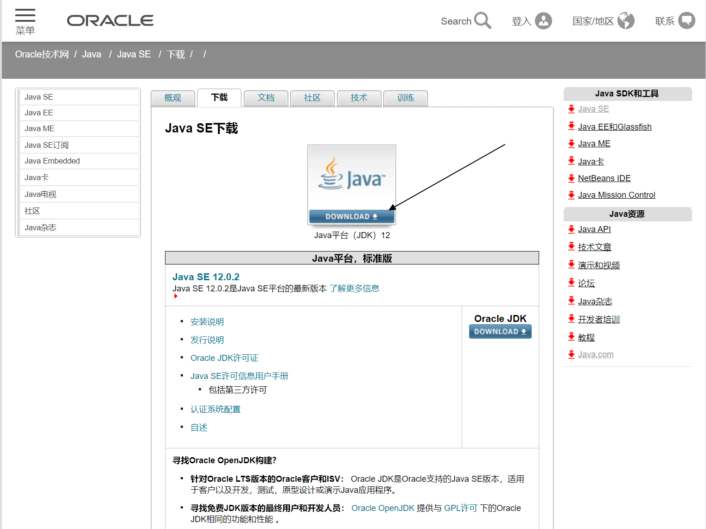
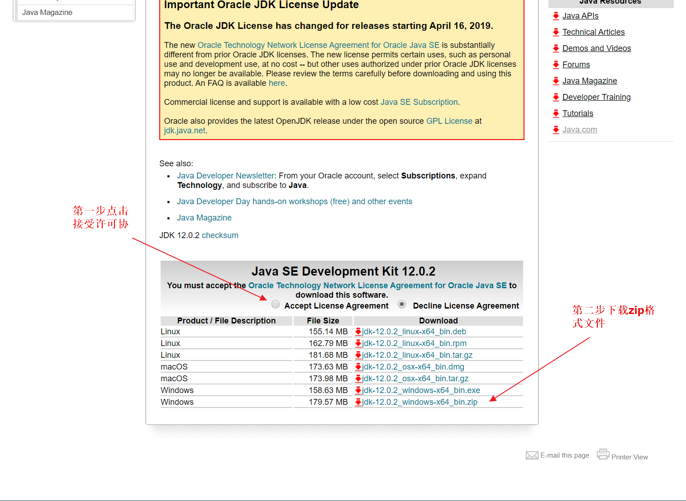
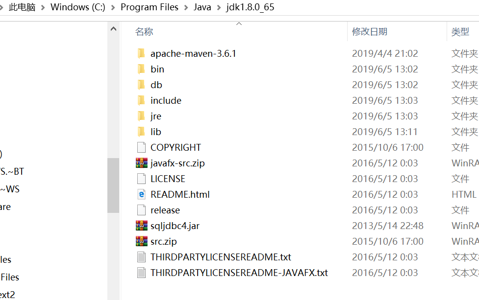
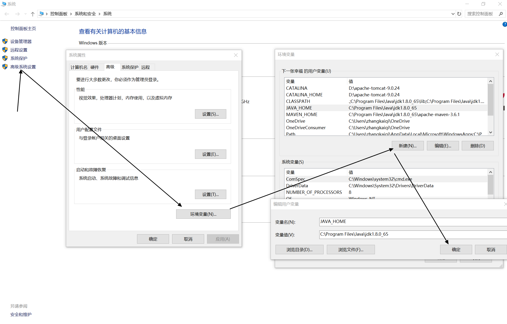
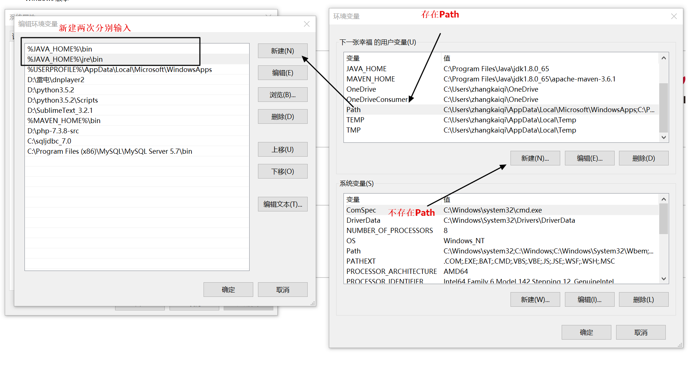
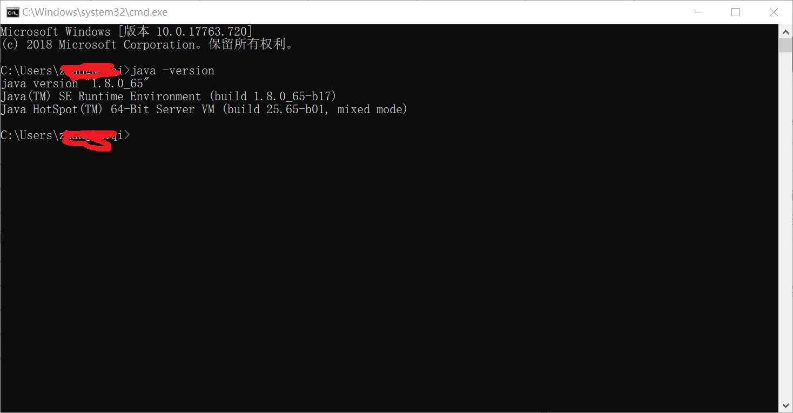

# 1. 下载JDK
>[官网下载](https://www.oracle.com/technetwork/java/javase/downloads/index.html)
>
>## 建议下载zip文件的java,如果下载exe文件的java删除不干净

# 2. 安装JDK
>解压文件到指定目录,如我的安装目录
>
# 3. 配置java环境变量
>在我的电脑右键点击属性
>
>1. 新建变量名"JAVA_HOME",变量值"C:\Program Files\Java\jdk1.8.0_65"
>2. 新建变量名"CLASSPATH",变量值".;%JAVA_HOME%\lib\dt.jar;%JAVA_HOME%\lib\tools.jar"  
>3. 如果存在path的话双击Path项,不存在的话新建变量名"Path",变量值"%JAVA_HOME%\bin;%JAVA_HOME%\jre\bin"
>

# 4. 测试是否安装成功
> 打开cmd窗口,输入 java -version,如果出现以下消息,恭喜你安装成功
>
