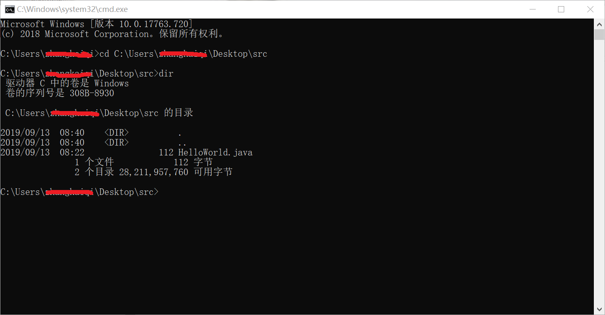
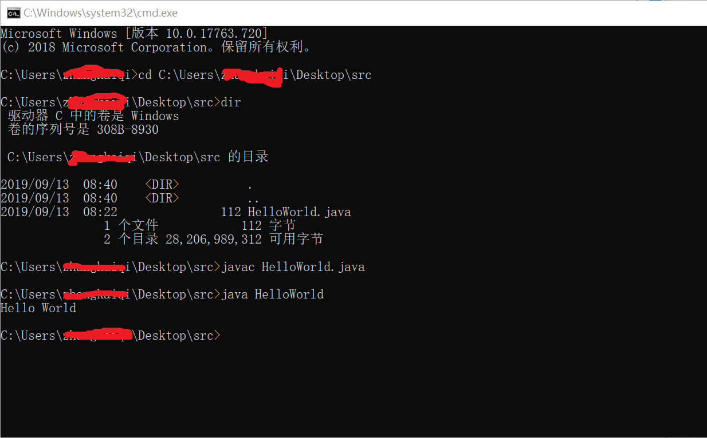

## 新建java文件 
>重命名HellowWorld.java,文件内容如下  
```
public class HelloWorld{
	public static void main(String[] args) {
		System.out.println("Hello World");
	}
}
```  

## 编译java文件  
>打开cmd,cd到HellowWorld.java文件目录下,再次输入dir命令可以看到当前目录下的所有文件  
>  
>输入javac HelloWorld.java  
>如果没有任何输出,说明编译成功,否者编译失败,请仔细检查java代码是否有误  

## 运行java文件  
>编译成功后,会在HelloWorld.java当前目录下生成HelloWorld.class文件  
>  
>输入java HelloWorld,注意java命令不要带后缀.class,javac命令需要带上后缀.java  
>  
